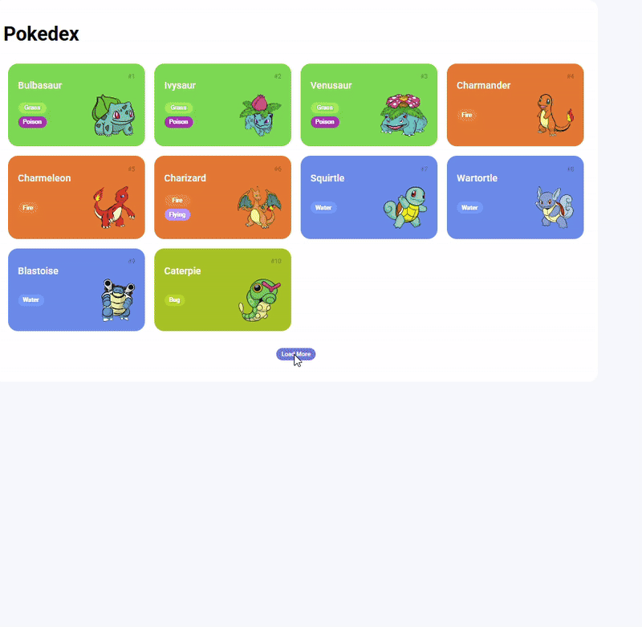

# Pokedex ⚡


Uma Pokedex web simples e interativa, construída para praticar o consumo de APIs e manipulação do DOM. Este projeto é resultado do Santander Bootcamp Fullstack Java + Angular, uma iniciativa da Santander com a execução e plataforma de ensino da Digital Innovation One (DIO).

## 💻 Tecnologias Utilizadas

* **HTML:** Para a estrutura da página.
* **CSS:** Para estilização e layout, incluindo a responsividade.
* **JavaScript:** Para toda a lógica da aplicação, como a requisição à API e a manipulação dos elementos.
* **PokeAPI:** A API pública e gratuita utilizada para obter os dados dos Pokémon.

## ✨ Funcionalidades

* **Listagem de Pokémon:** Exibe uma lista de Pokémon com seus nomes e tipos.
* **Detalhes em Modal:** Ao clicar em um Pokémon, uma janela pop-up (modal) exibe informações mais detalhadas como habilidades, altura, peso e estatísticas.
* **Paginação com "Load more":** Utiliza o conceito de "lazy loading" com um botão "Carregar Mais" para buscar e adicionar novos Pokémon à lista, evitando sobrecarregar a página com muitas requisições de uma vez.
* **Interface Responsiva:** O layout se adapta a diferentes tamanhos de tela (desktop, tablet, mobile).

## 🚀 Como Usar

Para rodar este projeto localmente, basta seguir os passos abaixo. Não é necessário um servidor web.

1.  **Clone o repositório:**
    ```bash
    git clone [https://github.com/KeslyAquinoa/pokedex.git](https://github.com/KeslyAquinoa/pokedex.git)
    ```
2.  **Navegue até o diretório do projeto:**
    ```bash
    cd pokedex
    ```
3.  **Abra o arquivo `index.html`** no seu navegador de preferência.

## 🖼️ Preview
<div align= "center">
  
</div>


## 🤝 Contribuição


Contribuições são bem-vindas! Se você tiver sugestões, encontrou um bug ou quer adicionar uma nova funcionalidade, sinta-se à vontade para abrir uma *issue* ou um *pull request*.

## 📄 Licença

Este projeto está licenciado sob a licença [MIT](https://opensource.org/licenses/MIT).

---
